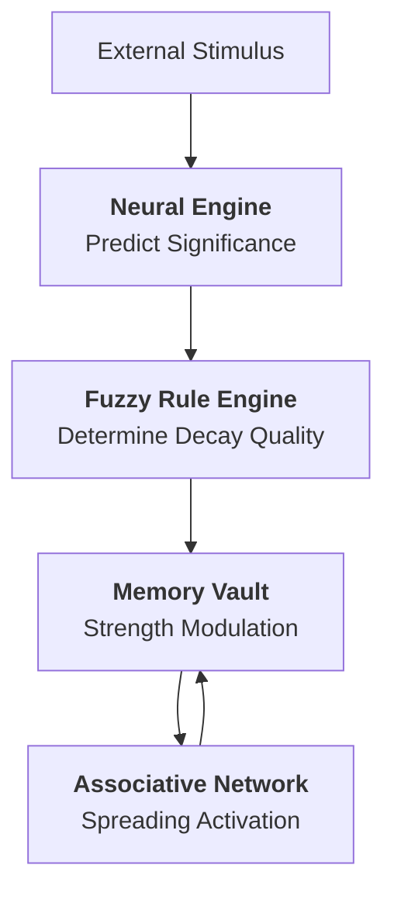

# 🌌 AetherMind: Neuro-Fuzzy Cognitive Agent

## Vision
To develop a sophisticated soft computing system that mirrors **biological memory dynamics**. **AetherMind** aims to move beyond static data storage by implementing fluid, importance-driven retention, associative links, and intelligent forgetting.

## Core Pillars

### 1. Learning (Neural Layer)
The **ImportanceNet** (implemented in PyTorch) serves as the primary appraisal mechanism. It analyzes memory attributes — emotional weight, frequency of interaction, and age — to predict a "Ground Truth" importance score.
- **Technology**: Multi-layer Perceptron (MLP)
- **Input**: `[usage_count, age, emotional_weight]`
- **Output**: `importance_score [0, 1]`

### 2. Reasoning (Fuzzy Layer)
AetherMind uses **Fuzzy Logic** to translate neural predictions into actionable decay rates. This ensures that high-importance memories are protected even as they age, while lower-priority items are recycled as "cognitive noise."
- **Rules**: If Importance is High AND Age is New → Decay is Minimal.
- **Inference**: Mamdani-style FIS (Fuzzy Inference System).

### 3. Association (Spreading Activation)
Memories in AetherMind are not isolated. They exist within a **Semantic Web**. Accessing one memory sends a "pulse" of activation to related memories sharing the same tags, simulating how one thought leads to another.

---

## Intelligence Pipeline

---

## Component Breakdown

- **`agent.py`**: The "Cortex". Manages the memory storage, consolidation of similar thoughts, and the spreading activation cycle.
- **`importance_model.py`**: The "Amygdala". A PyTorch neural network that evaluates the emotional and functional significance of data.
- **`fuzzy_logic.py`**: The "Prefrontal Cortex". Logic-based rules that modulate biological-style decay constants.
- **`interactive.py`**: The "Interface". A robust CLI for engaging with the agent in a human-centric way.
- **`run_experiments.py`**: The "Lab". A scientific suite for benchmarking the Neuro-Fuzzy hybrid against standard models.

---

## Project Status: V1.0 Stable
AetherMind has successfully transitioned from a proof-of-concept to a stable execution engine.
- ✅ Hybrid Decay Model Verified
- ✅ Associative Memory (Spreading Activation) Integrated
- ✅ Neural Training Pipeline Converged
- ✅ Persistent JSON State Management Implemented
