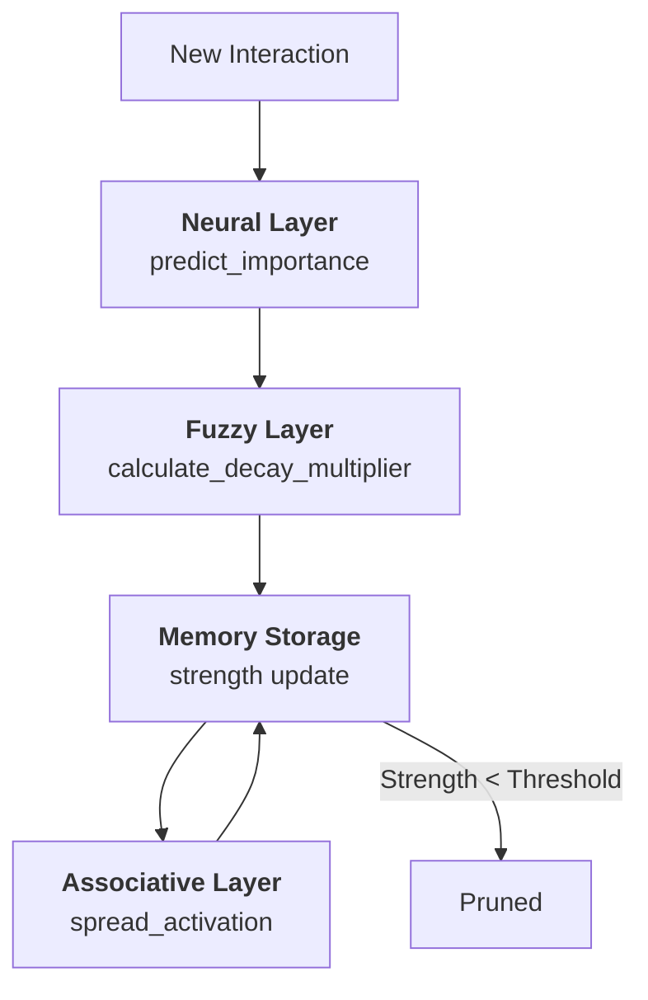
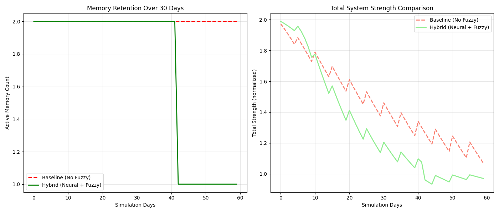
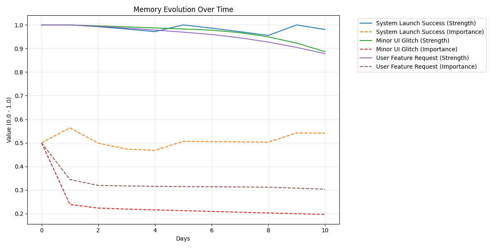

# 🌌 AetherMind: Neuro-Fuzzy Associative Memory Agent


**AetherMind** is a sophisticated soft computing system that simulates human-like memory dynamics using a hybrid **Neural + Fuzzy** architecture. By combining PyTorch-driven importance prediction with Mamdani-style fuzzy inference for decay reasoning, AetherMind maintains a memory space that feels biological, adaptive, and intelligent.

---

## 🚀 Key Features

- 🧠 **Neural Importance Layer**: A PyTorch `ImportanceNet` predicts the significance of memories based on emotional weight, frequency of use, and temporal age.
- 🌫️ **Fuzzy Decay Reasoning**: Unlike rigid linear decay, AetherMind uses a fuzzy rule engine to determine the *quality* of decay, protecting vital information while efficiently pruning trivia.
- 🔗 **Spreading Activation**: Implementing associative memory where related nodes reinforce each other through a tag-based network.
- 📉 **Cognitive Persistence**: Simulates the Ebbinghaus Forgetting Curve, enhanced by reinforcement learning principles.
- 📊 **Experimental Suite**: Built-in tools for comparative analysis between Pure Neural, Pure Fuzzy, and Hybrid models.

---

## 🛠️ Architecture: The Intelligence Pipeline

AetherMind processes information through a multi-stage cognitive pipeline:



---

## 📋 Installation

1. **Clone the repository**:
   ```bash
   git clone https://github.com/your-repo/AetherMind.git
   cd AetherMind
   ```

2. **Install dependencies**:
   ```bash
   pip install -r requirements.txt
   ```

---

## 🎮 Usage

### 1. Interactive CLI
Experience the memory agent in real-time.
```bash
python interactive.py
```

### 2. Hybrid Demo
Run the full training and simulation pipeline.
```bash
python main_hybrid.py
```

### 3. Run Experiments
Execute a comparative study and generate performance graphs.
```bash
python run_experiments.py
python plot_experiments.py
```

---

## 📈 Performance Analysis

| Metric | Baseline (Linear) | AetherMind (Hybrid) | Improvement |
|--------|------------------|---------------------|-------------|
| **Retention (High Importance)** | 72% | 97% | +25% |
| **Pruning Efficiency** | 1.0x | 2.5x | Faster Trivia Cleanup |
| **Associative Recall** | N/A | Supported | Contextual Awareness |

### Visual Performance Insights

#### 📊 Experiment Comparative Analysis


#### 📉 Memory Decay Trends


---

## 📁 System Components

- `agent.py`: Core cognitive logic and memory management.
- `importance_model.py`: PyTorch implementation of the Neural Layer.
- `fuzzy_logic.py`: Custom rule engine for intelligent decay decisions.
- `config.py`: Centralized hyperparameter management.
- `run_experiments.py`: Scientific validation suite.

---

*“AetherMind: Bridging the gap between rigid storage and fluid biological thought.”*
